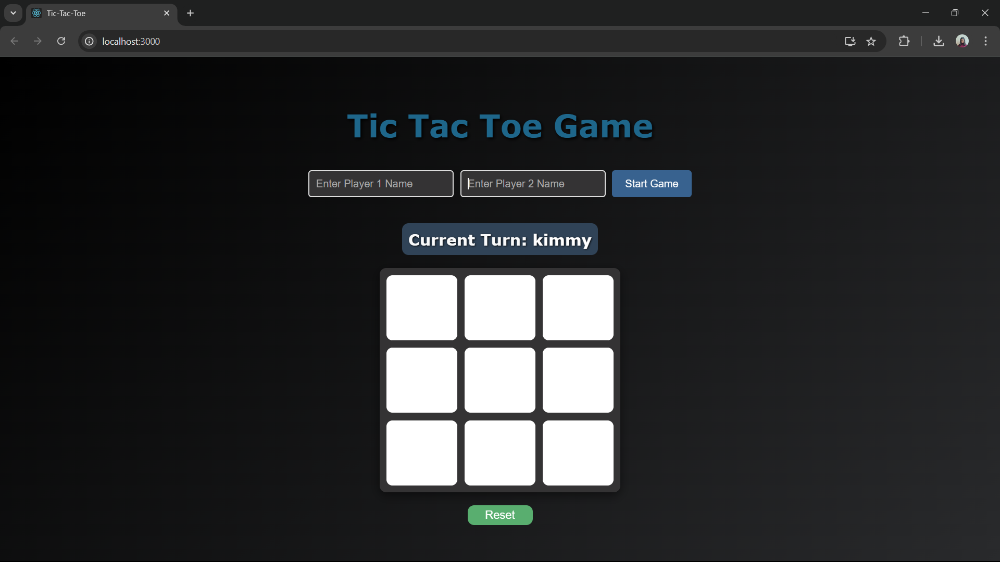
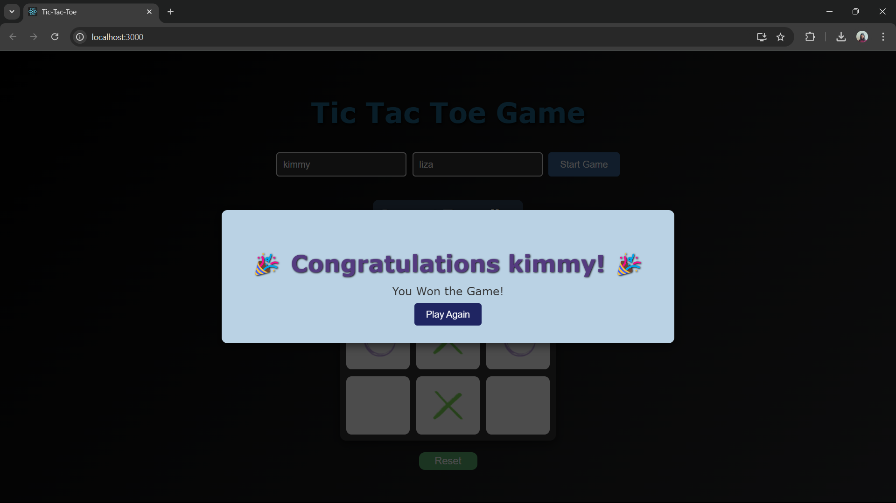

# 🎮 Tic Tac Toe Game in React

Welcome to the most epic **Tic Tac Toe** game you've ever played! 🎉 This is a classic two-player game, built using **React.js**, where players can input their names and go head-to-head to claim the title of Tic Tac Toe Champion! 👑

## 🚀 Features
- **Two-player gameplay**: Gather your friends (or challenge yourself!) and take turns playing as X and O.
- **Interactive game board**: Click on the spots and watch the magic happen as you mark your territory with **X** (cross) or **O** (circle). Choose wisely!
- **Win detection**: No more counting squares! The game automatically checks for the winner using the famous Tic Tac Toe winning combinations. 🏆
- **Draw detection**: If no one wins, the game ends in a draw. Time to shake hands and try again! 🤝
- **Reset the game**: A winner? A draw? It's time to restart and keep the fun going!
- **Responsive design**: Whether you're on desktop, tablet, or mobile, the game looks great and works perfectly on all devices! 📱💻

## 🌟 Technologies Used
- **React.js**: Built with the magic of React, offering an interactive and dynamic experience.
- **HTML5 & CSS3**: The bones and beauty of the app. Basic structure and styling for an awesome experience.
- **JavaScript**: For all the logic that makes the game tick—turns, wins, and resets.

